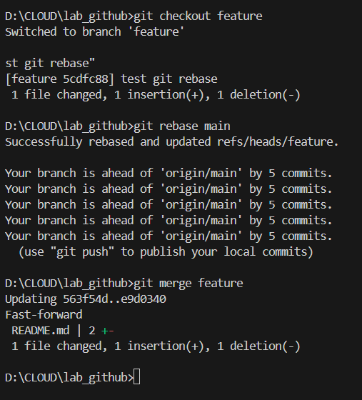
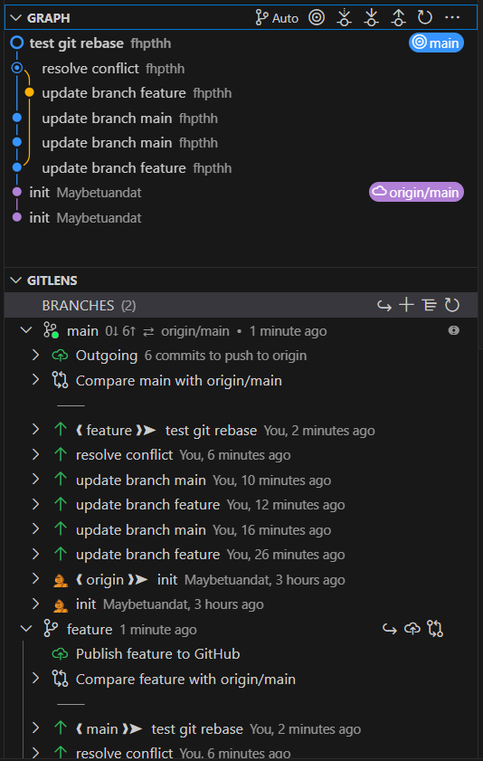

# Phan Thị Hồng Huế

### Date created: 
26/10/2025

### Project Title
Lab_Github

### Description
Thực hành các bài tập về **Git**

**1. SetUp Your Rrepository**
**The following are the steps you will take to create your git repository, add your python code, and post your files on GitHub.**

Step 1. Create a GitHub profile (if you don’t already have one).

Step 2. Fork a repository from https://github.com/Maybetuandat/lab_github  and provide a link to your forked GitHub repository here:

```c
 https://github.com/fhpthh/lab_github.git
```

Step 3. Complete the tasks outlined in the table below and copy and paste your git commands into the “Git Commands” column. The first git command is partially filled out for you

|  |**Tasks**| **Git Commands**|
|------------|------------|---------|
|A| Clone the GitHub repository to your local repository. | `git clone https://github.com/fhpthh/lab_github.git ` |
B| Move your bikeshare.py and data files into your local repository | ```move <source_path>\bikeshare.py D:\CLOUD\lab_github\```|
C | Create a .gitignore file containing the name of your data file.|`echo "data.csv" > .gitignore`|
D | List the file names associated with the data files you added to your .gitignore |`type .gitignore`|
E | Check the status of your files to make sure your files are not being tracked |`git status` |
F | Stage your changes. |`git add .`|
G | Commit your changes with a descriptive message. | `git commit -m "move bikeshare.py and  add data.csv to .gitgnore"`
H | Push your commit to your remote repository. | `git push origin main`


**2. Improve Documentation** 
**Now you will be working in your local repository, on the BikeShare python file and the README.md file. You should repeat steps C through E three times to make at least three commits as you work on your documentation improvements.**


|  |**Tasks**| **Git Commands**|
|------------|------------|---------|
|A|Create a branch named documentation on your local repository | `git branch documentation` |
B| Switch to the documentation branch. | `git switch documentation`|
C | Update your README.md file.|`echo "## Updated documentation section" >> README.md`|
D | Stage your changes |`git add README.md`|
E | Commit your work with a descriptive message |`git commit -m "update README"` |
G | Push your commit to your remote repository branch. | `git push origin documentation`
H | Switch back to the master branch. | `git checkout main`

**3. Additional Changes to Documentation.**

**In a real world situation, you or other members of your team would likely be making other changes to documentation on the documentation branch.  To simulate this follow the tasks below.**


|  |**Tasks**| **Git Commands**|
|------------|------------|---------|
|A|Switch to the documentation  branch. | `git checkout documentation` |
B| Make at least 2 additional changes to the documentation - this might be additional changes to the README or changes to the document strings and line comments of the bikeshare file. | `git switch documentation`|
C | After each change, stage and commit your changes. When you commit your work, you should use a descriptive message of the changes made.  Your changes should be small and aligned with your commit message.|`echo "## Updated documentation section" >> README.md`|
D | Push your changes to the remote repository branch|`git add README.md`|
E | Switch back to the master branch. |`git commit -m "update README"` |
F | Check the local repository log to see how all the branches have changed | `git push origin documentation`
G | Go to Github.  Notice that you now have two branches available for your project, and when you change branches the README changes. | `git checkout main`


**3. So sánh ***git merge*** và ***git rebase*****
**Git merge**
Tạo và di chuyển sang nhánh mới feature
```
git checkout -b feature
git add README.md
git commit -m "update branch feature"
```
- Quay trở lại nhánh main
```
git checkout main
git add README.md
git commit -m "update branch main"
```

- Dùng lệnh **git merge** để merge feature vào main
``` 
git merge feature -m "merge feature to main"
```

**Git rebase**
- Chuyển sang nhánh feature
- Cập nhật file README.md
- **git rebase main**



### So sánh giữa Merge và Rebase

| **Merge** | **Rebase** |
|------------|------------|
| `Git merge` là lệnh cho phép hợp nhất (merge) các nhánh trong Git. | `Git rebase` là lệnh cho phép tích hợp các thay đổi từ một nhánh này sang nhánh khác. |
| Trong **Git Merge**, nhật ký (log) sẽ hiển thị toàn bộ lịch sử của quá trình gộp commit. | Trong **Git Rebase**, nhật ký (log) là tuyến tính vì các commit được “phát lại” (rebase). |
| Tất cả các commit trên nhánh **feature** sẽ được kết hợp thành một commit duy nhất trên nhánh **master/main**. | Tất cả commit sẽ được **rebase** và giữ nguyên số lượng commit khi thêm vào nhánh **master/main**. |
| `Git merge` thường được dùng khi nhánh đích là **nhánh dùng chung (shared branch)**. | `Git rebase` thường được dùng khi nhánh đích là **nhánh cá nhân (private branch)**. |

**Commit graph**




### Files used
README.md

### Credits

"## Updated documentation section" 
